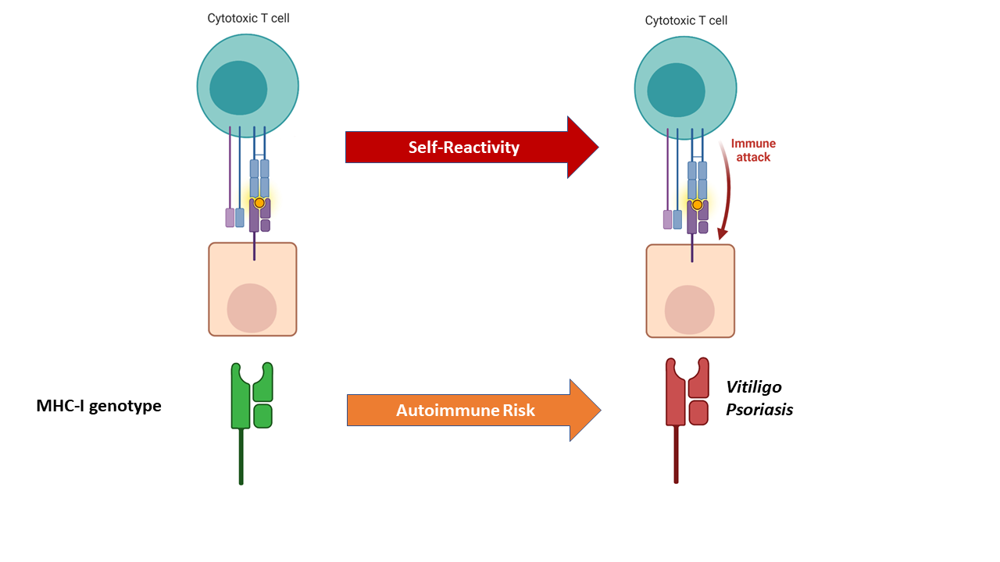
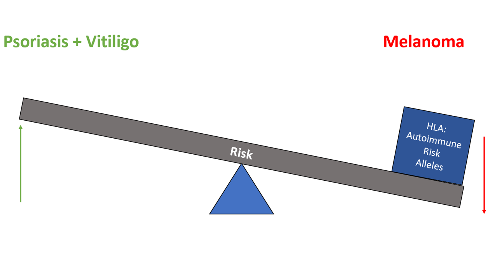

# MelMHC: Autoimmune MHC-I Alleles in Melanoma

**Ave** - or more classically *welcome* - gentleperson of erudition. As an astute and avid archaelogist, you are to be commended on your dogged determination, digging into the immunological bases of autoimmunity and cancer, and the relationships these conditions share. In this repository you will find the code needed to reproduce the findings reported by [J. V. Talwar](https://jvtalwar.github.io/dk-isle/) et al. in [*Autoimmune Alleles at the Major Histocompatibility Locus Modify Melanoma Susceptibility*](https://www.biorxiv.org/content/10.1101/2021.08.12.456166v1.full), a study focused on investigating the relationship between tissue-specific autoimmune associated MHC-I alleles and cancer risk in melanoma.  

## Graphical Overview:

 
 

## Organization:

This repository is organized accordingly:
    
    MelMHC
    ├── build   # Compiled files (alternatively `dist`)
    ├── docs    # Documentation files (alternatively `doc`)
    ├── src     # Source files (alternatively `lib` or `app`)
    ├── test    # Automated tests (alternatively `spec` or `tests`)
    ├── tools   # Tools and utilities
    ├── LICENSE                 
    └── README.md
     

I hope this repository has proven to be helpful in both ameliorating intractable immune investigations and affording an avenue for veritably validating veracity. I wish you good fortune in the analyses to come, and perhaps one day our paths may cross in the near future. Until that day comes though... *may the odds be ever in your favor*!
